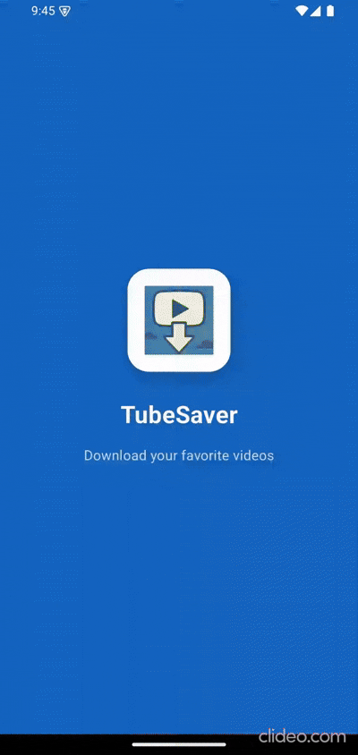

# YouTube Downloader Flutter

Build a basic native YouTube download manager in Flutter for AuthorityMart Media Internship Task.

## Demo

## Functionality:
- Allow user to paste a YouTube video URL.
- Fetch video metadata (title, thumbnail, resolution options).
- Let the user select resolution and download the video.
- Show download progress.
- Long press to delete video.
- Pause and resume download.

## Non-Functional Requirements:
- Test cases.
- Proper folder structure.